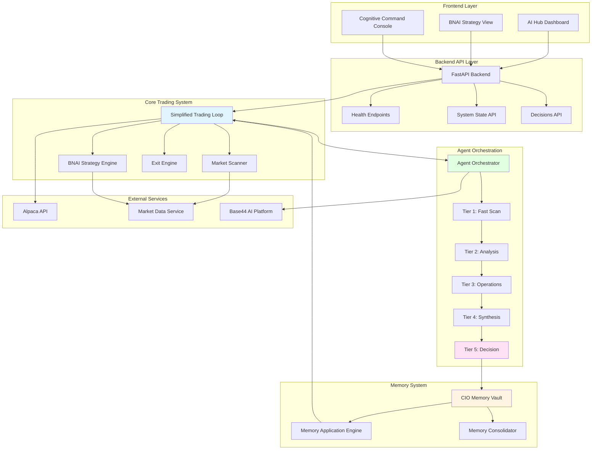
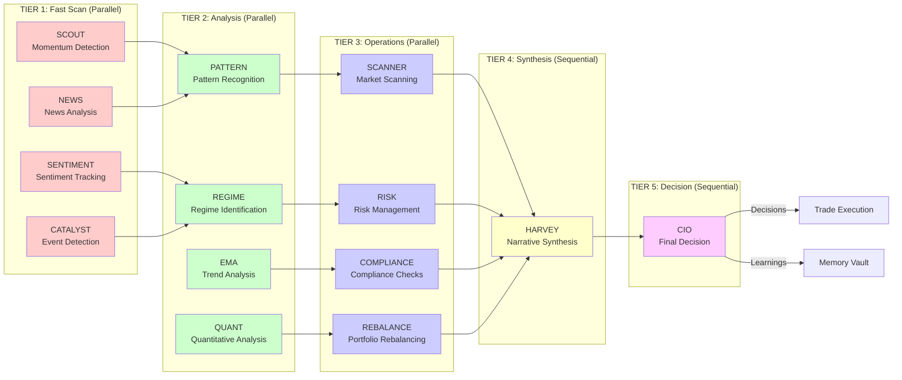
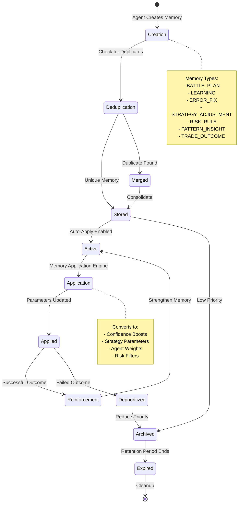
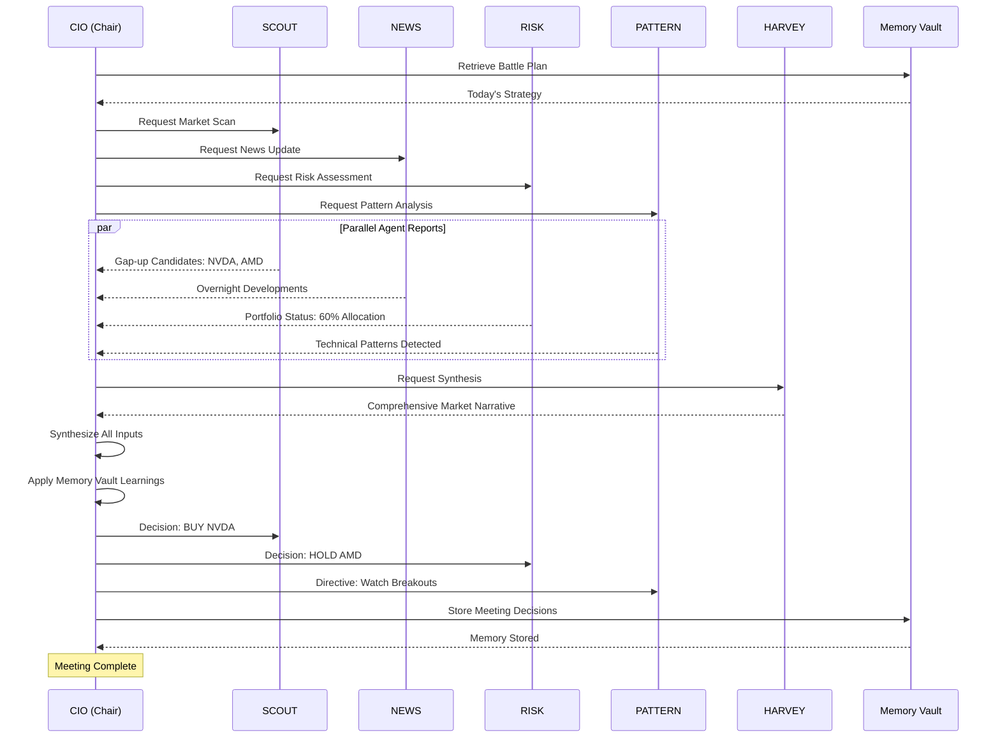
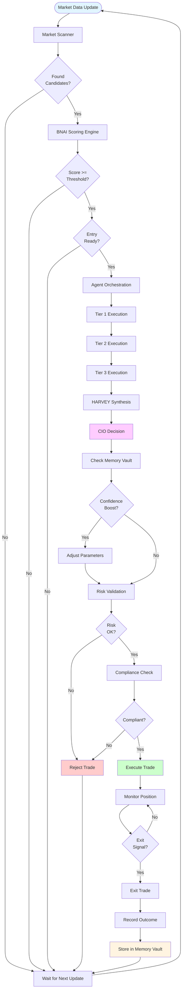
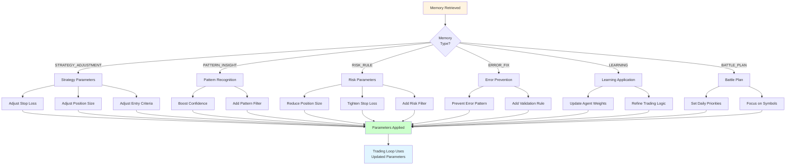
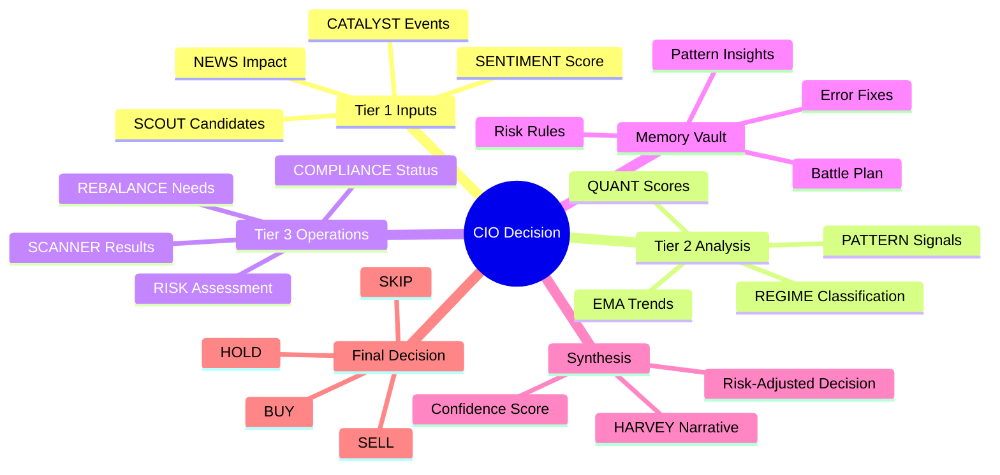
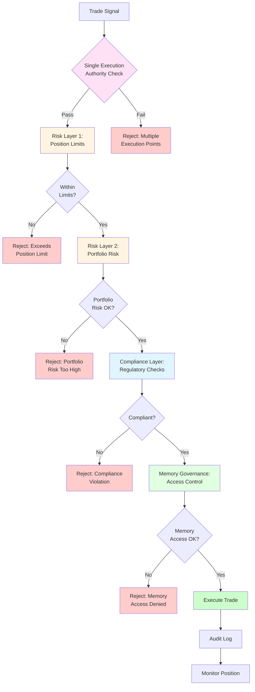

```mermaid
gantt
    title Daily Agent Execution Schedule
    dateFormat HH:mm
    axisFormat %H:%M
    
    section Pre-Market
    SCOUT Scan          :09:00, 5m
    NEWS Update         :09:00, 5m
    CATALYST Check      :09:00, 5m
    Board Meeting       :09:25, 5m
    
    section Market Hours
    SCOUT Continuous    :09:30, 6h30m
    NEWS Continuous     :09:30, 6h30m
    PATTERN Analysis    :09:30, 6h30m
    RISK Monitoring     :09:30, 6h30m
    CIO Decisions       :09:30, 6h30m
    
    section Post-Market
    Performance Review  :16:00, 30m
    Memory Consolidation:16:30, 30m
    Battle Plan Creation:17:00, 30m
```

```mermaid
graph LR
    subgraph "Data Sources"
        ALPACA[Alpaca API]
        NEWS_API[News Feeds]
        SOCIAL[Social Media]
    end
    
    subgraph "Data Processing"
        MARKET_DATA[Market Data Service]
        INDICATORS[Technical Indicators]
        SCORING[BNAI Scoring]
    end
    
    subgraph "Agent Processing"
        AGENTS[14 AI Agents]
        ORCH[Orchestrator]
    end
    
    subgraph "Decision Layer"
        SYNTHESIS[Synthesis Engine]
        MEMORY[Memory Vault]
        DECISION[Decision Engine]
    end
    
    subgraph "Execution"
        VALIDATION[Risk/Compliance]
        EXECUTION[Trade Execution]
        MONITORING[Position Monitoring]
    end
    
    ALPACA --> MARKET_DATA
    NEWS_API --> MARKET_DATA
    SOCIAL --> MARKET_DATA
    
    MARKET_DATA --> INDICATORS
    INDICATORS --> SCORING
    
    SCORING --> AGENTS
    MARKET_DATA --> AGENTS
    
    AGENTS --> ORCH
    ORCH --> SYNTHESIS
    
    SYNTHESIS --> MEMORY
    MEMORY --> DECISION
    
    DECISION --> VALIDATION
    VALIDATION --> EXECUTION
    EXECUTION --> MONITORING
    
    MONITORING --> MEMORY
    
    style MARKET_DATA fill:#e1f5ff
    style MEMORY fill:#fff4e1
    style DECISION fill:#ffccff
    style EXECUTION fill:#ccffcc
```

# System Architecture Diagrams

This document contains visual representations of the Quantum Trade AI system architecture using Mermaid diagrams. These diagrams illustrate system flow, agent orchestration, memory management, and decision-making processes.

---

## 🏗️ Overall System Architecture

---

## 🤖 Agent Tier Execution Flow

---

## 🧠 Memory Vault Lifecycle

---

## 👥 AI Board Meeting Flow

---

## 📊 Complete Trading Decision Flow

---

## 🔄 Memory Application Engine Flow

---

## ⏰ Time-Aware Agent Execution

---

## 🎯 Decision Synthesis Process

---

## 📈 System Data Flow

---

## 🔐 Security & Governance Flow

---

## 📝 Notes

- All diagrams use Mermaid syntax and render automatically on GitHub
- Diagrams illustrate the showcase architecture, not production implementation details
- Flow directions indicate data and control flow
- Color coding helps distinguish different system components
- These diagrams complement the written documentation in other files

---

## 🔗 Related Documentation

- [ARCHITECTURE.md](ARCHITECTURE.md) - Detailed system architecture
- [AUTONOMOUS_AGENTS.md](AUTONOMOUS_AGENTS.md) - Agent details and roles
- [CIO_MEMORY_VAULT.md](CIO_MEMORY_VAULT.md) - Memory system documentation
- [AI_BOARD_MEETINGS.md](AI_BOARD_MEETINGS.md) - Board meeting documentation
